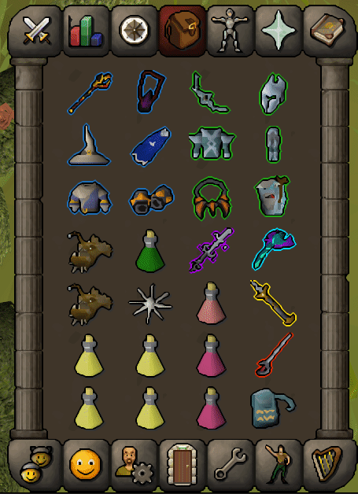
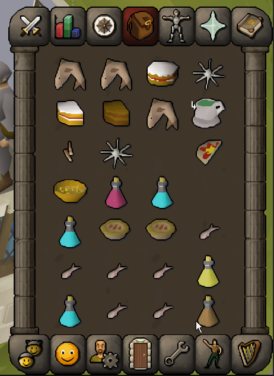

# Consumable Cooldowns

Find the delays when consuming confusing? Worry no more. This plugin adds cooldown indicators for the various consumable items in your inventory.

## Customizable cooldown indicators
The cooldown indicators have a plethora of customization options. You can toggle the cooldown indicator preview in the config options to see how your setting look. If you are missing an option you would like to see, feel free to open an issue or a pull request.

## Support for (almost) all consumable items
The plugin supports the following consumable item categories:
- Regular food (lobster, monkfish, shark, etc.)
- Potions/drinks (super restore, super attack, saradomin brew, etc.)
- Combo food (karambwan & gnome foods)
- Variable delay sliced foods
  - First two cake slices
  - Free-to-play pizza's & pies
  - Pay-to-play pies
  - Cooked crab meat (5 bites)

The delays displayed are based on information from this [OSRS Wiki page](https://oldschool.runescape.wiki/w/Food/Fast_foods) and in-game tests. If you find an incorrect delay or a missing consumable, please let me know by opening an issue or pull request.

